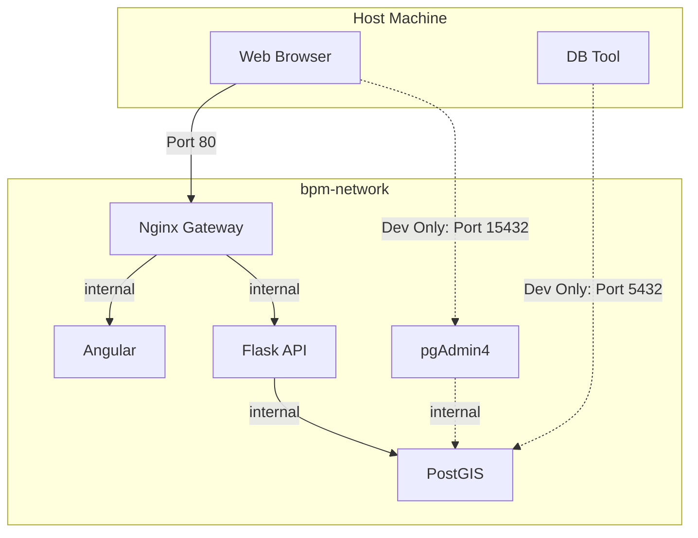

# Docker Orchestration Logic

This document explains the logic behind the Docker Compose configuration, specifically how the **Production Base** (`compose.yaml`) and **Development Overrides** (`compose.dev.yaml`) interact to create two distinct environments using the same codebase.

## 🔄 The "Override" Pattern

We do not maintain two completely separate compose files. Instead, we use a **layering strategy**:

### Layer 1: `compose.yaml` (The Foundation)

  * **Defines:** The "Production-Ready" state.
  * **Setup:** Sets up the network, the database, and the production build commands.
  * **Security default:** No internal ports (4000, 5432) are exposed to the host. Only the **Gateway** (Port 80) is open.

### Layer 2: `compose.dev.yaml` (The Modification)

  * **Applied:** On top of Layer 1.
  * **Overrides commands:** Switches production servers (Gunicorn) for debug servers (Flask Run).
  * **Adds Volumes:** Mounts local source code into containers for hot-reloading.
  * **Exposes Ports:** Opens DB ports for local debugging tools.

### Command Logic

**Production (Only Layer 1)**

```bash
docker compose -f compose.yaml up
```

**Development (Layer 1 + Layer 2)**

```bash
docker compose -f compose.yaml -f compose.dev.yaml up
```

-----

## 🏭 Production Logic (`compose.yaml`)

The goal of this file is **Isolation** and **Performance**.

### 1\. The Gateway (Nginx)

[Image of Nginx reverse proxy diagram]

  * **Role:** The *only* container allowed to talk to the outside world.
  * **Port:** Maps **Host 80 → Container 80**.
  * **Logic:** It accepts traffic and routes it internally via the `bpm-network` to either frontend or backend services.
      * *Benefit:* This prevents CORS issues and protects backend endpoints from direct access.

### 2\. Backend (Flask + Gunicorn)

  * **Command:** `gunicorn --bind 0.0.0.0:4000 flaskr:app`
  * **Why Gunicorn?**
      * Flask's built-in server (`flask run`) handles one request at a time and is insecure.
      * Gunicorn is a WSGI server that spawns multiple workers to handle concurrent traffic efficiently.
  * **Network:** It sits on `bpm-network` but does **not** expose ports. It is accessible *only* by the Gateway.

### 3\. Database (PostGIS)

  * **Isolation:** Like the backend, it has `no ports:` section. It cannot be accessed from your laptop, only by the Backend container via the hostname `db`.
  * **Healthcheck:** The `pg_isready` check ensures the Backend doesn't crash by trying to connect before the Database is fully booted.

-----

## 🛠 Development Logic (`compose.dev.yaml`)

The goal of this file is **Developer Experience (DX)**.

### 1\. Code Syncing (Volumes)

We use "Bind Mounts" to make code changes instant.

**Frontend Volumes:**

```yaml
volumes:
  - ./frontend-bpm:/app       # 1. Syncs your local code to container
  - /app/node_modules         # 2. The "Anti-Clobbering" Hack
```

> **The "Anti-Clobbering" Hack:**
>
>   * **Rule 1:** Maps your local folder to the container. If you save a file locally, the container sees it instantly.
>   * **Rule 2:** Prevents your local (potentially empty or OS-incompatible) `node_modules` folder from overwriting the container's installed dependencies. It forces the container to use its own internal `node_modules`.

**Backend Volumes:**

```yaml
volumes:
  - ./backend-bpm:/api        # Syncs Python code
```

### 2\. Command Overrides

**Backend:** `flask run --debug`

  * Replaces `gunicorn`.
  * Enables the interactive debugger (provides stack traces in the browser).
  * Watches files for changes and restarts the server automatically.

### 3\. Debugging Access

**Database:**

```yaml
ports:
  - "5432:5432"
```
  * To connect **DBeaver** or **TablePlus**  to `localhost:5432`.

**pgAdmin:**

  * A completely new service added *only* for dev.
  * Provides a web GUI at `localhost:15432` to manage the DB.

-----

## 📡 Networking & Service Discovery

How do containers talk to each other? They use **Internal DNS**.
All services share the network `bpm-network`. Docker creates a DNS entry for every service name.

1.  **Frontend → Backend:**

      * The Angular app (running in browser) sends request to `localhost/api/`.
      * Nginx receives it and proxies to `http://backend:4000`.
      * Docker resolves `backend` to the internal IP of the Flask container.

2.  **Backend → Database:**

      * Flask connects using `postgresql://.../db:5432`.
      * Docker resolves `db` to the internal IP of the PostGIS container.

-----

## 📊 Summary Visualization

